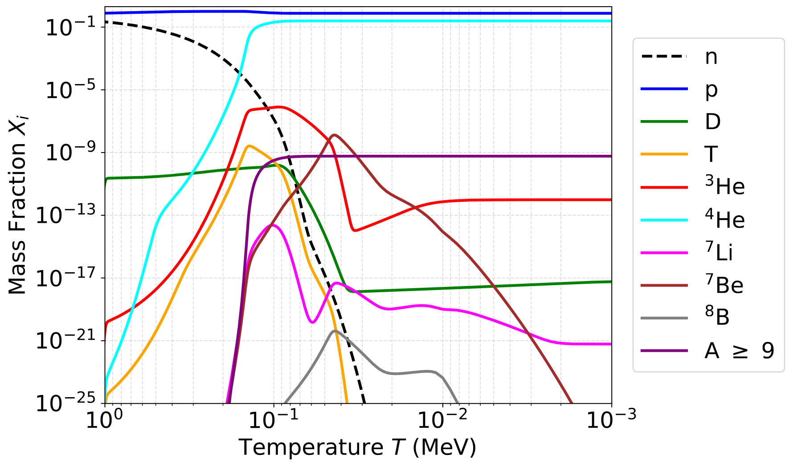
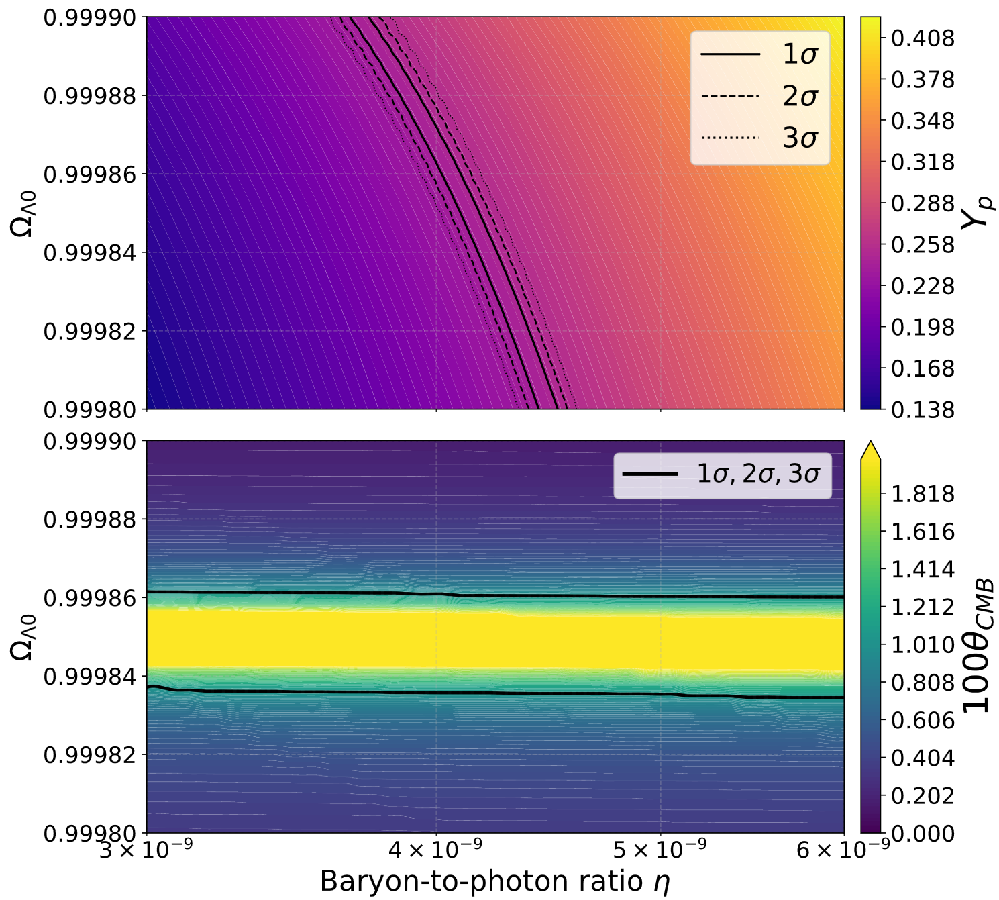

# Onion-Universe-BBN
Numerical integration of Big Bang Nucleosynthesis for the Onion cosmological model. It also allows for computations on standard LCDM varying the baryon-to-photon ratio.
## Structure
The framework is split into a C module for high-performance calculations (BBN), and a Python module for data analysis and Recombination computations.

### 1. BBN Integrator (`src/bbn.c`)
- **Stiff ODE Solver:** Implements a semi-implicit backward Euler method with adaptive step-sizing to integrate the primordial reaction network.
- **Nuclear Network:** Handles a stiff $31 \times 31$ Jacobian matrix tracking elements up to $^{44}\text{Ti}$.
- **Reaction Rates:** Uses the **JINA Reaclib** database, incorporating custom detailed-balance corrections and algebraic fits for updated Deuterium rates (LUNA 2020).

To compile, execute:

```bash
gcc -O3 -march=native bbn_c.c -o bbn_c -lm
````

To run the program, use:

```bash
./bbn_c
```

### 2. Recombination & CMB (`src/cmb.py`), (`src/plot_bbn.py`), (`src/D_Reactions.py`)
- **Ionization History:** Solves the non-equilibrium Recombination era using the Peebles and Saha equations via Backward Differentiation Formulas.
- **Likelihood Analysis:** Computes multi-parameter grids ($\eta$ vs $\Omega_{\Lambda 0}$) to extract $1\sigma$, $2\sigma$, and $3\sigma$ confidence intervals for $Y_p$, $D/H$, and the CMB angular scale ($\theta_{CMB}$).
- **Data Visualization:** Automated generation of mass fraction evolutions, Schramm plots, and 2D parameter contour maps.

## Results

### BBN Abundances in the Onion Cosmology
The slower expansion rate of the Onion model leads to a distinct nucleosynthesis freeze-out, requiring a heavily shifted baryon-to-photon ratio ($\eta$) to match Helium observations, and completely depleting primordial Deuterium.



### CMB Angular Scale & $Y_p$ Likelihood Contours
Intersection of the observational constraints on the $\eta - \Omega_{\Lambda 0}$ parameter space.


